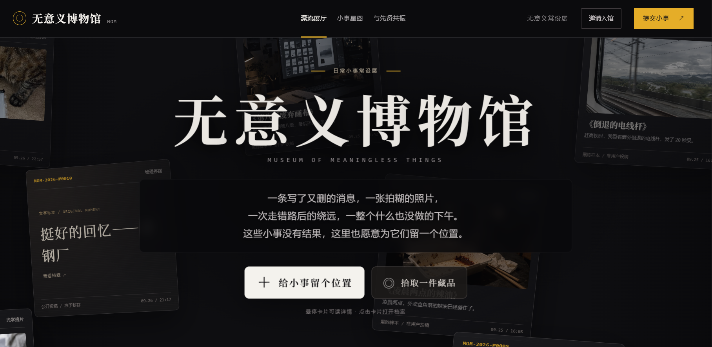

# 无意义博物馆 · 西安老钢厂特展

**为没有产出的日常瞬间，建立一份庄重而荒诞的档案。**

改了八遍却被废弃的画布，凌晨两点外卖盒里凝固的辣油，截屏后再没看过的书页，赶高铁时望着倒退电线杆发呆的二十秒。

《无意义博物馆》是围绕黑客松主题「无用之用」创作的交互式数字展览。观众留下一件小事，经过一本正经的无用性质检，得到带有红色印章的入库凭证。公开的小事进入漂流展厅，也可能在星图里与另一段经历相遇。

**只连接事情，不给人贴标签。**



## 为什么做这个项目

我们习惯记录成果、计划和里程碑，却很少为那些没有完成什么的时刻留下位置。这个博物馆把正式的编号、鉴定、出票与封存仪式，交给最普通的生活切片。

老钢厂曾经生产具体的物件；在这个展厅里，我们收藏没有产出的瞬间。它们不必证明自己有价值，也不必最终变成某个成功故事，仍然可以被认真看见。

作品的趣味来自严肃收藏仪式与微小日常之间的反差，共鸣来自真实原话，以及不同小事里相似的动作和结果。

## 三个展区

### 漂流展厅

- CSS 3D 空间中的卡片缓慢漂流，鼠标移动带动展厅视差。
- 每批最多展示 6 件不同馆藏，每件只渲染一次，离开画面后循环进入；可手动换批浏览。
- 有图藏品展示影像，无图藏品以大字原话呈现为文字标本。
- 悬停卡片可暂停所在轨道并突出显示，点击打开完整档案。
- 点击巨幅标题触发粒子溃散，让藏品成为画面焦点；角落入口可还原标题。
- 「拾取一件藏品」随机打开一份公开档案。
- 「空间折跃」在漂浮与记忆深渊隧道之间切换：两种模式共用 DOM 卡片与展陈目录，漂流每批显示 6 件，隧道沿纵深排列全部展陈，滚轮或方向键推进，手机可在空白处滑动或使用前进／后退按钮。悬停或键盘聚焦时，卡片移到前景并使其他卡片虚化；点击仍打开原馆藏档案。

### 虚无共振星图

展厅与星图使用同一份精选展陈目录，包括有具体细节的真实投稿、8 件原始展品与 12 件明确标记的日常情景样本。图片本身也属于展陈细节，带图投稿不会因为文字简单而被隐藏。仅有“白等了一会”“聊了很久”等概括的纯文字记录暂不展出，原投稿与本机深库不删除、不改写。样本增加光影、余温、路边的小动物等日常细节。节点缓慢游动，可以拖动单个节点，或拖动一条连线的两个端点。

联系来自原话里的经历。例如，废弃的画布与未发出的消息，可以因为「准备过，没有交出去」而相遇。点击节点后聚焦相关小事，相同的关系标签只显示一次，右侧以打印纸呈现两件小事和一句联系解释，可展开阅读全文。

刚提交公开小事后，进入星图会优先点亮自己的节点，持续闪烁标识位置；有联系时播放约 3 秒、可跳过的相遇剧情。没有刚提交的公开小事时，默认呈现一段已有联系的相遇。

星图目前按规则识别经历，不依赖模型做向量相似度计算。相同分类或相似标题不会自动生成连接；规则覆盖不到的口语表达可能漏配。没有连接的小事也可以独自漂流。

### 与先贤共振

从普通物件、动作与情境出发，浏览历史人物的消遣、观察和发现。展区提供有出处的本地策展案例，也可以带着正在填写的小事寻找相关经历，再返回投稿表单。

公开投稿可主动同意联网扩展联想。启用模型后，服务端会生成查询、检索 Wikipedia，再根据检索材料提取候选故事。自动生成的故事及其关联仍需要核对，不能视为已经人工验证的历史事实。

## 一件小事如何入馆

1. 写下 4—280 字的小事，标题和照片可选，选择公开展出或深库特藏。
2. 工控终端逐行输出无用性检测日志，完成质检仪式。明确的生产任务可能被规则打回。
3. 泛旧纸张逐段吐出，红色椭圆印章下砸，伴随轻微震动和可用的音效。
4. 核对凭证并导出 PNG。附图以 CSS 灰度、对比度和混合效果融入纸张，无图时隐藏影像区域。
5. 确认封存后才正式保存。公开凭证化为微光进入展厅；私密凭证收入本机深库，并提示查看入口。

无用性检测属于作品交互，不是可靠的语义判断或内容审核。音效受浏览器播放策略限制，减少动态效果的系统偏好会停用部分动画。

## 我的深库

一个低调的档案抽屉：桌面从页脚进入，手机从顶部档案图标进入。

- 按时间查看自己的私密记录和已保存的公开投稿历史。
- 重看原话、鉴定记录与凭证，再次下载图片。
- 给旧馆藏补记一句话，导出或导入完整 JSON 备份。
- 使用 IndexedDB 保存，并迁移旧版本 localStorage 中的私密记录。

**深库仅属于当前设备、当前浏览器、当前网站地址，没有账号同步。** 换设备、换浏览器、切换域名或 HTTP/HTTPS 都不会自动迁移记录；清除网站数据也会删除本机记录。备份包含原话、照片和补记，请妥善保管。

## 数据与隐私

| 内容 | 保存或处理位置 | 可见范围 |
| --- | --- | --- |
| 确认封存的公开投稿 | 服务端 `data/artifacts.json`，同时尝试保存本机历史 | 所有访问展厅的观众 |
| 深库特藏 | 浏览器本机 IndexedDB，使用本地规则鉴定 | 当前设备、浏览器和网站地址 |
| 公开投稿鉴定 | `/api/appraise`；启用模型时发送原话和标题给所配置的模型服务 | 网站服务端及启用的模型提供方 |
| 联网人物联想 | 公开投稿主动同意后调用服务端检索与模型 | 网站服务端及相关外部服务 |
| 下载的凭证和深库备份 | 用户自行保存的位置 | 取决于后续分享方式 |

私密流程在浏览器内完成，不上传到公共馆藏，也不使用联网人物联想。公开投稿的本机历史保存失败时，界面会提示并提供重试；公共展厅已入库不等于本机历史一定保存成功。

导出凭证时隐藏原话，只影响导出的图片，不会把已公开的馆藏变成私密馆藏。

首批 8 件预置展品及额外图谱情景样本均属于展陈样本，不代表真实用户投稿，不能计入真实观众数据。

## 技术实现

| 部分 | 实现 |
| --- | --- |
| 页面与接口 | Next.js App Router、React、TypeScript |
| 样式与展厅 | Tailwind CSS、CSS 3D、CSS 动画 |
| 星图 | 自定义节点运动模拟、SVG 连线、Pointer Events 拖拽 |
| 标题溃散 | Canvas 粒子 |
| 凭证导出 | `html-to-image`，由页面排版生成 PNG |
| 图片处理 | 浏览器 Canvas 压缩，必要时通过 `heic2any` 转换 HEIC |
| 邀请二维码 | `qrcode.react` |
| 公开存储 | 单实例 JSON 文件、写入队列与临时文件替换 |
| 本机历史 | IndexedDB |
| 可选编目 | 兼容 Chat Completions 的模型接口，失败回退离线规则 |

照片由用户上传或来自项目预置素材，凭证图片由网页渲染导出。项目当前没有调用文生图模型。

## 本地运行

建议使用 Node.js 22 和 npm，依赖版本以 `package-lock.json` 为准。

```powershell
git clone https://gitee.com/copperii-nitrate/hackathon.git
cd hackathon
npm ci
Copy-Item .env.example .env.local
npm run dev
```

macOS / Linux 将复制命令替换为：

```bash
cp .env.example .env.local
```

浏览器访问 `http://localhost:3000`。开发服务监听 `0.0.0.0`，默认端口被占用时，以启动日志中的地址为准。

### 手机与现场大屏

本地演示时，手机与电脑连接同一 Wi-Fi，电脑防火墙允许 3000 端口。手机应访问 `http://电脑局域网IP:3000`，不能使用 `localhost` 或 `127.0.0.1`。

「邀请入馆」会根据当前地址及本机网络生成入口。也可在 `.env.local` 配置固定地址：

```dotenv
NEXT_PUBLIC_PUBLIC_URL=http://你的局域网IP:3000
```

更改网络或地址后重新启动开发服务，并重新生成二维码。生产环境修改 `NEXT_PUBLIC_` 配置后需要重新构建。

### 照片上传

原图上限为 30 MB。浏览器先压缩和缩放，保存约 1 MB 以内的图像数据，再用于入库和导出；服务端还会检查图像格式及数据长度。

常见 JPG、PNG、WebP 图片可以提交。其他格式取决于浏览器解码能力；HEIC 转换失败时，请从相册导出为 JPG。原始大图不保存到馆藏。

## 可选模型配置

默认使用离线规则。需要模型编目时，在 `.env.local` 中设置：

```dotenv
AI_BASE_URL=https://your-provider.example/v1
AI_API_KEY=your-key
AI_MODEL=your-model
IS_OFFLINE_DEMO=false
```

密钥只用于服务端调用，不能放入 `NEXT_PUBLIC_` 变量或提交到仓库。公开投稿的标题、标签和鉴定文案可由模型生成，原话保留；模型超时或响应不合规时回退离线编目。

`cot` 字段是公开的策展观察文案。GDP、熵增等数值是作品内的拟制指标，不是科学测量或官方认证。

启用编目模型不改变星图的规则匹配方式。公开投稿另有必需的安全审核和主题准入：

```dotenv
CONTENT_REVIEW_BASE_URL=https://your-provider.example/v1
CONTENT_REVIEW_API_KEY=your-key
CONTENT_REVIEW_MODEL=your-vision-model
```

必须使用支持图片输入和 JSON 输出的模型。出票前和公开入库前均由服务端检查，拒绝安全问题及不符合主题的内容；积极开心的生活切片仍可入馆。审核未配置、超时或结果不确定时暂停公开投稿，不回退放行。私密深库保持本机存储，不自动发送至审核服务。详见 [审核配置与边界](docs/content-review.md)。

## 生产运行与更新

```bash
npm ci
npm run build
npm run start -- --hostname 127.0.0.1 --port 3000
```

单台 Ubuntu 服务器可使用 Nginx 转发到本机 3000 端口，通过 systemd 管理应用。服务用户需要对 `data/` 有写权限；公网入口的请求体限制应与上传策略一致。

已按 `/opt/museum`、服务用户 `museum`、systemd 服务 `museum` 配置的服务器，可以这样更新：

```bash
cd /opt/museum
sudo -u museum git pull --ff-only origin master
sudo -u museum npm ci --cache /var/cache/museum-npm
sudo -u museum npm run build && sudo systemctl restart museum
curl -I --retry 5 --retry-connrefused --retry-delay 2 http://127.0.0.1:3000
```

这些命令适用于已有部署，不包含首次创建服务的步骤。拉取或安装依赖失败时应停止更新，排查后再构建；构建失败不会执行上述重启命令。

更新前备份 `data/artifacts.json` 和服务器环境配置。不要用本地演示数据覆盖服务器真实投稿，也不要在部署清理时删除数据目录。

## 当前边界

- 公开馆藏每 5 秒检查一次，不是 WebSocket 实时同步。ETag 未变化时返回无正文的 `304`，浏览器保留现有数据；服务端复用未变化文件的 JSON 快照，避免重复读取、解析和序列化。
- 公共存储采用单实例 JSON 文件。图片一同保存，数据增长会增加读写和返回体积；多实例和长期运营需要调整为数据库与图片存储。
- 没有账号体系，也没有深库跨设备同步。
- 经历匹配是有限规则，可能漏配；关系说明不推断作者身份、心理或动机。
- 当前公开投稿通过模型安全与主题审核后展示，尚无完整的管理员复核、撤回与防刷机制。
- 大规模公开前，应增加接口限流、请求与存储容量限制、模型费用约束、投稿管理、HTTPS 和备份恢复。
- 模型安全审核经过有限样例测试，不能保证零漏检；上线仍需举报与馆方下架机制。

## 主要目录

| 路径 | 用途 |
| --- | --- |
| `app/page.tsx` | 页面入口、模式切换与共享馆藏 |
| `app/globals.css` | 展厅、图谱、凭证与出纸动效 |
| `components/ArtifactStreamHero.tsx` | 3D 漂流展厅与文字标本 |
| `components/MuseumGallery.tsx` | 展览模式切换、惯性穿梭与聚焦 |
| `components/CardItem.tsx` | 两种展览模式共用的 DOM 卡片 |
| `components/MuseumGallery.module.css` | 空间折跃、隧道与景深样式 |
| `lib/gallery-space.ts` | 圆柱坐标排布、循环纵深与过渡计算 |
| `components/VoidConstellation.tsx` | 星图选择、连线与相遇剧情 |
| `components/EncounterPrinter.tsx` | 相遇打印纸 |
| `components/AncientResonance.tsx` | 与先贤共振展区 |
| `components/AppraisalModal.tsx` | 投稿、质检、出票与封存 |
| `components/ArchivalTicket.tsx` | 入库凭证 |
| `app/api/artifacts/route.ts` | 公开馆藏读取与入库 |
| `app/api/appraise/route.ts` | 公开投稿鉴定 |
| `app/api/ancient-resonance/route.ts` | 人物匹配与可选联网检索 |
| `app/api/share-address/route.ts` | 局域网邀请地址 |
| `lib/exhibition-catalog.ts` | 两个展区共享的公开目录 |
| `lib/resonance.ts` | 原话经历识别与连接规则 |
| `lib/constellation-physics.ts` | 节点运动与局部拖拽 |
| `lib/private-archive.ts` | 本机历史、迁移与备份 |
| `lib/store.ts` | 服务端 JSON 持久化 |
| `lib/prepare-image.ts` | 图片压缩与格式转换 |
| `public/exhibits/` | 预置展陈图片 |
| `docs/competition-submission.md` | 比赛提交材料草稿，工具与素材披露需按当前实现更新 |

## 验证与比赛演示

```bash
npm run typecheck
npm run build
node --experimental-strip-types --test tests/*.test.mjs
```

推荐演示路径：浏览漂流展厅 → 留下一件真实小事 → 质检与盖章 → 确认公开封存 → 进入星图找到自己的星 → 阅读一次相遇 → 从深库重看凭证。

现场请区分真实投稿和样本，提前验证手机入口、照片上传、下载凭证与大屏刷新。若使用模型、图片或其他素材，请按实际情况补充工具、来源与许可披露。

**有些时刻没有产出，却确实发生过。这里给它们留一个位置。**
